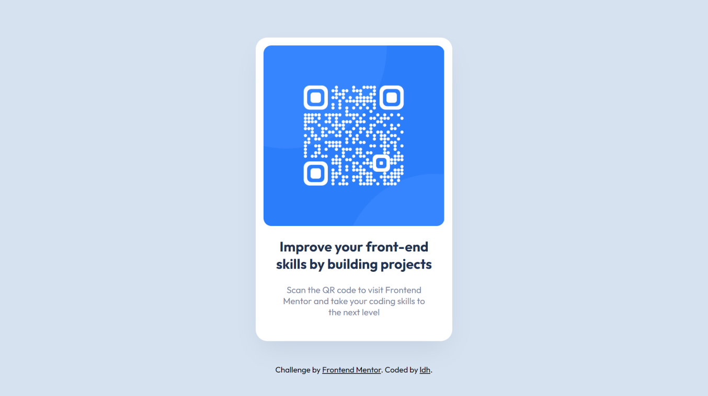

# Frontend Mentor - QR code component solution

This is a solution to the [QR code component challenge on Frontend Mentor](https://www.frontendmentor.io/challenges/qr-code-component-iux_sIO_H). Frontend Mentor challenges help you improve your coding skills by building realistic projects.

## Table of contents

- [Overview](#overview)
  - [Screenshot](#screenshot)
  - [Links](#links)
- [My process](#my-process)
  - [Built with](#built-with)
  - [What I learned](#what-i-learned)
  - [Continued development](#continued-development)
  - [Useful resources](#useful-resources)
- [Author](#author)
- [Acknowledgments](#acknowledgments)

## Overview

### Screenshot

### Links

- Solution URL: [solution URL](https://github.com/LukeDHarrison/qr-code-frontend-mentor-solution)
- Live Site URL: [live site URL](https://qr-code-fm-solution.netlify.app/)

## My process

### Built with

- Semantic HTML5 markup
- CSS custom properties
- Flexbox

### What I learned

### Continued development

Create a functional QR generator with link input and formatter

### Useful resources

## Author

- Website - [Luke D Harrison](https://www.ldh.dev)
- Frontend Mentor Profile - [@LukeDHarrison](https://www.frontendmentor.io/profile/LukeDHarrison)
- Twitter - [@LukeDHarrison\_](https://twitter.com/LukeDHarrison_)

## Acknowledgments
